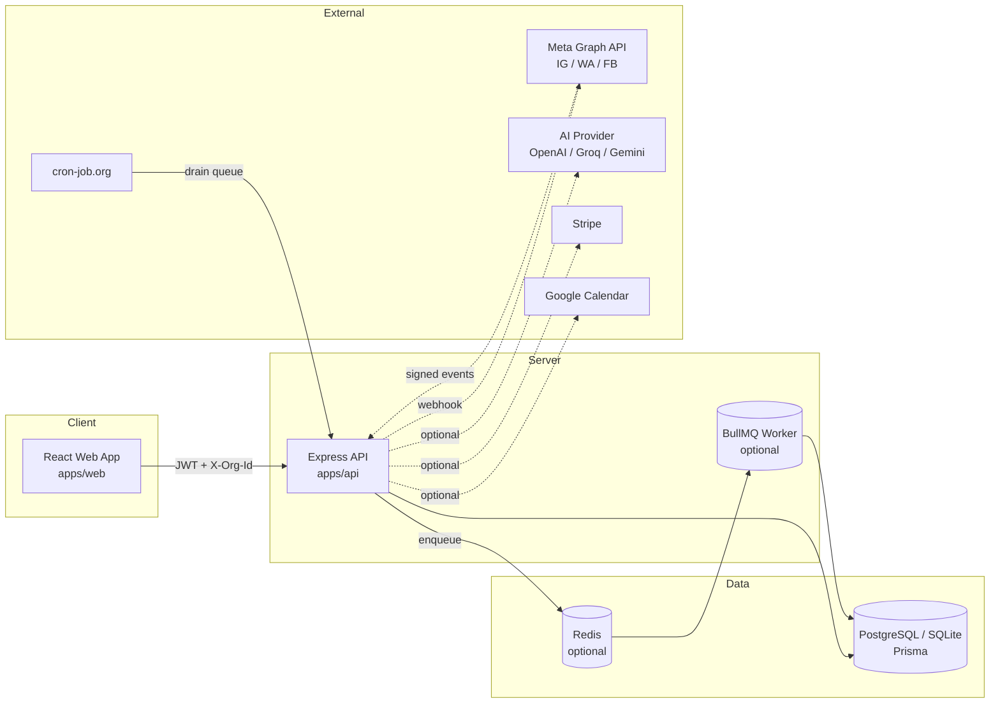
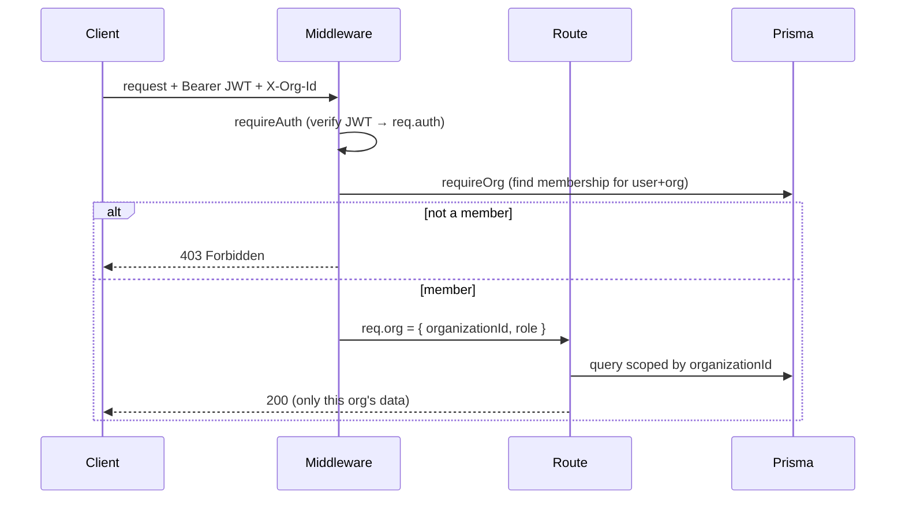
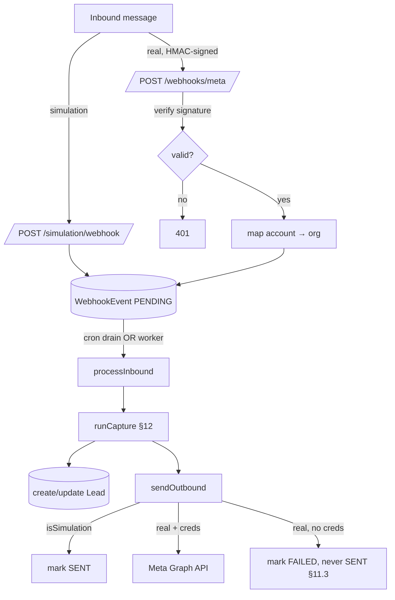
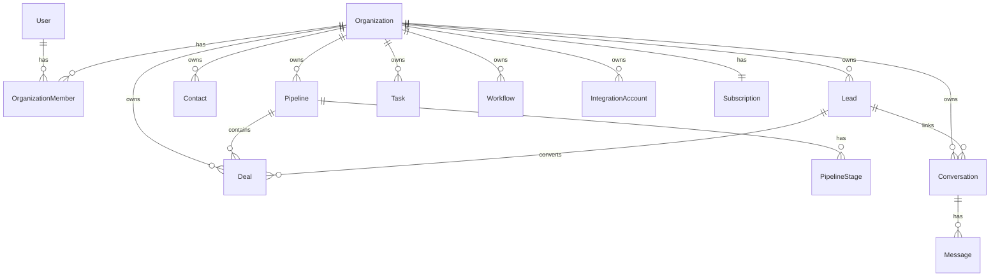

# LeadOS — Architecture & Contributing Guide

A tour of how LeadOS is put together and how to work on it.

---

## 1. System overview



**Free-by-default:** Redis, the worker, AI, Stripe, Meta and Calendar are all
optional. Without them the app runs on SQLite + an in-process cron drain +
rule-based AI + mock billing/messaging. Each is a drop-in upgrade via env vars.

---

## 2. Monorepo layout

```
leados/
├─ apps/
│  ├─ api/                 # Express + TypeScript + Prisma
│  │  ├─ src/
│  │  │  ├─ routes/        # HTTP endpoints (one file per domain)
│  │  │  ├─ services/      # business logic (ai/, meta/, billing, queue, …)
│  │  │  ├─ middleware/    # auth, tenant isolation, rate limit, errors
│  │  │  ├─ lib/           # helpers, jwt, cache, errors, env validation
│  │  │  ├─ app.ts         # express app assembly
│  │  │  ├─ index.ts       # server entrypoint (+ env validation, shutdown)
│  │  │  └─ worker.ts      # BullMQ worker entrypoint
│  │  ├─ prisma/schema.prisma
│  │  ├─ scripts/          # demo-seed, walkthrough, make-superadmin
│  │  └─ tests/            # vitest unit + supertest integration
│  └─ web/                 # React + Vite + React Router
│     └─ src/{pages,components,lib}
├─ packages/shared/        # enums, roles, validation shared by api + web
├─ openapi.yaml            # API spec (Swagger/Postman)
├─ docker-compose.yml      # full local stack
└─ *.md                    # README, DEPLOYMENT, DEMO_SCRIPT, ARCHITECTURE
```

---

## 3. Request lifecycle (tenant isolation)



Every normal query is scoped by `req.org.organizationId`. The **only** sanctioned
bypass is Super Admin aggregate routes (`/api/v1/admin/*`), guarded by
`requireSuperAdmin`.

---

## 4. Social lead-capture flow (simulation + real)



---

## 5. The "free default → paid upgrade" pattern

Each external concern is behind an interface with a free default:

| Concern | Free default | Upgrade (env) |
|---------|--------------|---------------|
| Queue | in-process cron drain | `REDIS_URL` → BullMQ worker |
| Cache | in-memory Map (`lib/cache.ts`) | Redis (same get/set) |
| Rate limit | in-memory (`middleware/rateLimit.ts`) | Redis INCR/EXPIRE |
| AI | rule-based (`services/ai/heuristics.ts`) | `AI_PROVIDER` + key |
| Billing | mock (`services/billing.ts`) | `STRIPE_SECRET_KEY` |
| Messaging | simulation | `META_*` creds |
| Calendar | mock | `GOOGLE_*` creds |
| Email | console | `EMAIL_ENABLED` + `SMTP_URL` |

To add a new provider, keep the interface, add the real transport, and gate it
on config presence — never break the free path.

---

## 6. Local development

```bash
pnpm install
cp apps/api/.env.example apps/api/.env      # set JWT_SECRET
pnpm db:generate && (cd apps/api && npx prisma db push)
pnpm dev                                     # api :4000 + web :5173
```

- **Tests:** `pnpm --filter @leados/api test` (39 tests, isolated test DB)
- **Type-check:** `pnpm --filter @leados/api exec tsc --noEmit`
- **API docs:** http://localhost:4000/api/docs
- **Demo:** `ALLOW_DEMO_SEED=true pnpm db:seed` then `pnpm --filter @leados/api demo:walkthrough`

---

## 7. Conventions

- **Enums/roles/validation** live in `packages/shared` — single source of truth
  for both API and web. Add new statuses/roles there.
- **New endpoints:** create a file in `apps/api/src/routes/`, guard with
  `requireAuth` + `requireOrg(...)`, scope all queries by `organizationId`,
  mount in `app.ts`, and document in `openapi.yaml`.
- **Static route paths** (e.g. `/export.csv`) must be declared **before** `/:id`
  routes so Express doesn't treat them as params.
- **Secrets** only from env (never in code/logs). Boot fails in production on
  weak/missing config (`lib/validateEnv.ts`).
- **Errors:** throw typed `HttpError`s (`lib/errors.ts`); the central handler
  maps them to safe JSON.
- **Tests** for new logic: pure functions → `tests/unit.test.ts`; endpoints →
  `tests/api.test.ts` (supertest).

---

## 8. Data model (core entities)



See `apps/api/prisma/schema.prisma` for the authoritative definition.
